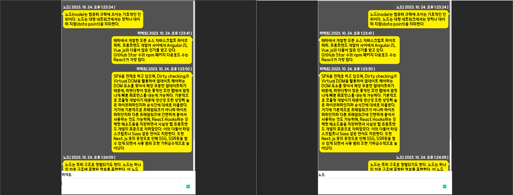

# WebSocket


## FE - REACT
### WebSocket 불러오기에 시간이 걸리니 내부에서 작성
```javascript
const ws = useRef(null);

useEffect(() => webSocketLogin(), []);

  const webSocketLogin = useCallback(() => {
    // 웹소켓 연결
    ws.current = new WebSocket('ws://localhost:8080/socket/chat');

    // 메세지 받으면 행동
    ws.current.onmessage = message => {
      console.log(message);
      const dataSet = JSON.parse(message.data);
      setSocketData(dataSet);
    };
  }, []);

  // 메세지 보내는 행동
  ws.current.send(sendData);
```

## BE -Spring

### WebSocketChat
WebSocket의 열고 닫고 메세지 받을 때 어떻게 동작할 지 작성

### WebSocketConfiguration.java
Spring Bean은 싱글톤으로 관리하지만 @ServerEndpoint 어노테이션인 클래스는 WebSocket 생성 시 마다 인스턴스가 생성되고 JWA에 의해 관리되기에 스프링의 @Autowired가 설정된 멤버들이 정상적으로 초기화 되지 않습니다. 이때 이를 연결해주고 초기화해주는 클래스가 필요합니다.
- Spring Bean은 인스턴스 생성부터 소멸까지의 인스턴스 생명주기 관리를 해주는 컨테이너의 자바 객체
- 싱글톤 패턴은 애플리케이션이 시작 될 때 static을 통해 인스턴스를 메모리에 딱 하나 할당하고, 뒤의 호출 시 마다 해당 인스턴스를 반환해주는 디자인 패턴
- JWA는 WAS에 설치되어 동작하는 어플리케이션
- WAS는 DB 조회나 다양한 로직 처리를 요구하는 동적인 컨텐츠를 제공하기 위해 만들어진 Application으로 HTML, CSS, 이미지, 자바로 작성된 클래스(Servlet포함 package, interface 등), 각종 설정 파일 등이 포함 됨

### WebSocketConfiguration.java  
CORS 정책을 위한 설정


